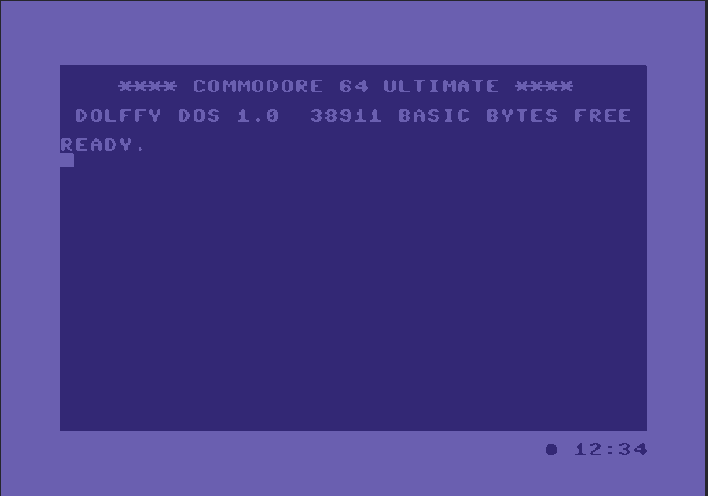

# Dolffy DOS

**A fast, modern KERNAL ROM for the Commodore 64, DolphinDOS parallel speed and
a clean-room JiffyDOS serial fast loader in one ROM, with optional Ultimate-only
extras (a real-time clock and a SHIFT LOCK indicator).**

<p align="center">
  
</p>

The stock C64 KERNAL is wonderfully **safe**: hit a random key and nothing much
happens. DolphinDOS and JiffyDOS, by contrast, are packed with extras, a
built-in machine-language monitor, function-key macros, a wedge of CTRL commands,
most of which most people never use. And kids love to just *mash keys* (who knows
why), so on a loaded KERNAL one stray combination can fire off a command and wipe
out the program you were about to show them. A built-in monitor was a treasure in
the 1980s, too; today you reach for the one in your emulator, or the Ultimate's
own tooling over its REST API, so baking one into the KERNAL is just space you
could spend better.

What you *do* still want is simple: disk access that is genuinely fast, and fast
on **whatever drive you happen to have**. When you sit down to load a game or fire
up a tool, it matters a great deal whether it comes up in five seconds or in a
minute and a half.

So Dolffy DOS drops the parts that no longer earn their keep and spends every
reclaimed byte on speed instead, getting the fastest protocol each of your drives
can manage out of the system, the full DolphinDOS parallel loader and a
clean-room JiffyDOS serial loader. On the Ultimate it also tackles the single
biggest day-to-day annoyance, the SHIFT LOCK key, with a clear on-screen
indicator, and since the machine already has a real-time clock, it puts a clock
on screen too, simply because it is nice.

Dolffy DOS (**Dolph**in + Ji**ffy**) is a drop-in replacement for the C64 KERNAL
ROM. It stays highly compatible with stock software, as compatible as DolphinDOS
and JiffyDOS themselves, which is to say very, while transparently speeding up
disk access on whatever drive you have:

- **DolphinDOS parallel** speed on the cabled drive (drive 8), the fastest path
  by a wide margin;
- **JiffyDOS-compatible serial fast LOAD/SAVE** on serial drives, a from-scratch,
  clean-room reimplementation of the wire protocol (see *Clean-room
  implementation* below);
- **stock serial** as the universal fallback, so every drive still works.

Nothing is locked to one scheme. The KERNAL probes **each device independently**
and picks the fastest protocol it can speak with *that* drive:
**parallel > JiffyDOS serial > stock**. The parallel path is drive 8 only, but
drive 8 is not tied to it, put a JiffyDOS or a plain serial drive on 8 and it
just uses that instead. So you can mix freely: a physical JiffyDOS drive, a
virtual DolphinDOS parallel drive, and a stock drive can all sit on the bus at
once, each running as fast as it can, and you can switch between them whenever you
like. There is nothing to configure per program, `LOAD` and `SAVE` just get
faster.

> Heads up: Dolffy DOS replaces the **C64 KERNAL** only. The matching **drive-side
> ROMs** (DolphinDOS 1541 ROM for the parallel path, a genuine JiffyDOS drive ROM
> for the serial fast path) are separate third-party components you must supply
> yourself. See *Drives and ROMs* and *Licensing*.

## Features

- **DolphinDOS parallel fast LOAD/SAVE** on the cabled drive (drive 8), the
  fastest path.
- **JiffyDOS-compatible serial fast LOAD/SAVE**: a clean-room reimplementation of
  the C64 side of the protocol (no JiffyDOS source used).
- **Per-device autodetect**: picks the best protocol per drive automatically:
  parallel > JiffyDOS serial > stock. No per-program setup.
- **Universal fallback**: any non-fast drive still works at stock serial speed.
- **PAL and NTSC**: the fast paths are calibrated for both.
- **Correct directory loads**: `LOAD"$"` (with or without a device number)
  relocates properly on every path.
- **Non-destructive directory wedge**: `@$` (drive 8) and `@$9` (drive 9) list a
  directory without wiping the BASIC program in memory.
- **DolphinDOS editor comfort keys**: CTRL+A/B/G/K/L plus RESTORE combinations
  (see *Keyboard shortcuts*).
- **Auto Ultimate detection**: shows a `COMMODORE 64 ULTIMATE` banner when a
  Command Interface is present, `COMMODORE 64 BASIC V2` otherwise.
- **Quickrun build**: a separate ROM where C=+RUN/STOP enters `LOa`, then `SYS`
  starts the loaded program.
- **Ultimate build extras**: a real-time clock and a SHIFT LOCK indicator (see
  *The Ultimate extras*).
- **Three ready-to-use builds**: Plain, Quickrun, and Ultimate ROMs.
- **Stock-compatible**: a drop-in 8 KB KERNAL; normal software keeps working.

## Why it is fast: a real-world example

Loading [**SlotShot**](https://github.com/PyCoLang/slotshot), a real C64 game:

| Setup                                              | Load time    |
| -------------------------------------------------- | ------------ |
| Stock KERNAL + stock 1541                          | ~90 s        |
| Original JiffyDOS KERNAL + JiffyDOS drive          | ~20 s        |
| **Dolffy DOS + JiffyDOS drive** (serial fast path) | ~23 s        |
| **Dolffy DOS + DolphinDOS parallel** (drive 8)     | **~5 s (!)** |

Figures are the author's own measurements and are indicative. The parallel path is
by far the fastest; on the serial path Dolffy lands a few seconds behind original
JiffyDOS.

The table lists one drive per setup, which misses the real point: with Dolffy
**you no longer have to choose between DolphinDOS and JiffyDOS.** On their own each
forces a trade-off, DolphinDOS is blistering over the parallel cable but only
drives a single unit, while JiffyDOS happily handles several drives but cannot do
parallel at all. Dolffy gives you both at once: a parallel-cabled drive gets the
full DolphinDOS speed *while* your serial drives run at JiffyDOS speed, each
device automatically using the fastest protocol it supports, with stock serial as
the fallback. Without this, a second drive typically drops back to slow stock
serial; here it stays fast. (The parallel path is unchanged from DolphinDOS,
exactly as fast, and the serial path is a few seconds behind original JiffyDOS,
not quite as optimized.)

## Three builds

Every release ships **three** ROM images. They share the same fast-disk core; the
differences are the quickrun shortcut and the Ultimate-specific extras.

| Build          | File                       | What you get |
| -------------- | -------------------------- | ------------ |
| **Plain**      | `dolffy.rom`               | The conservative, stable base. Full Dolphin + JiffyDOS fast disk, the non-destructive directory wedge, and nothing that draws on the screen. Runs anywhere a C64 KERNAL runs. |
| **Quickrun**   | `dolffy-quickrun.rom`      | Everything in *Plain*, **plus** C=+RUN/STOP: `LOa`, then `SYS` starts the loaded program. |
| **Ultimate**   | `dolffy-ultimate.rom`      | Everything in *Plain*, **plus** a real-time clock and a SHIFT LOCK indicator. Built for the Ultimate family. |

> Compatibility note: the **Ultimate** build is the experimental one. It installs
> a raster clock / SHIFT LOCK indicator and uses the Ultimate Command Interface
> (`$DF1C-$DF1F`), so it has a wider hardware-compatibility surface than Plain.
> If you want the safest KERNAL, or you use cartridges that depend on NMI or
> IO1/IO2 (`$DE00` / `$DF00`), start with **Plain**.

The **Plain** build auto-detects an Ultimate at boot: it shows the familiar
`COMMODORE 64 BASIC V2` banner on a plain C64, and rewrites it to
`COMMODORE 64 ULTIMATE` when a Command Interface is present. The **Ultimate** build
always shows `COMMODORE 64 ULTIMATE`. Both print a `DOLFFY DOS 1.0` line.

If you are not on an Ultimate, or you just want the most conservative ROM, use the
**Plain** build. If you want the classic one-key disk start workflow, use
**Quickrun**. If you are on an Ultimate and want the clock and the SHIFT LOCK
indicator, use the **Ultimate** build.

### The Ultimate extras

**SHIFT LOCK indicator.** The SHIFT LOCK key on the new Commodore 64 Ultimate has
been a recurring source of community complaints: it latches but gives no clear,
persistent feedback about its state, so it is easy to leave engaged by accident
and then wonder why everything types in the "wrong" case. The Ultimate build
answers that directly, it shows an indicator that reflects whether
SHIFT / SHIFT LOCK is currently active, so the key's state is visible at a glance.

**Real-time clock.** The Ultimate has a built-in real-time clock, so the Ultimate
build reads it over the Command Interface and shows a clock on screen.

> The clock follows the Ultimate's **Command Interface** setting. Enable Command
> Interface to show the clock; disable it if you prefer a clean border. When the
> Command Interface is off, the clock blanks itself while the SHIFT LOCK indicator
> continues to work.

## Download

Pre-built ROM images are published on the
[**Releases**](https://github.com/wallneradam/dolffydos/releases/latest) page. The
links below always serve the **latest** release:

- [`dolffy.rom`](https://github.com/wallneradam/dolffydos/releases/latest/download/dolffy.rom), the **Plain** build
- [`dolffy-quickrun.rom`](https://github.com/wallneradam/dolffydos/releases/latest/download/dolffy-quickrun.rom), the **Quickrun** build
- [`dolffy-ultimate.rom`](https://github.com/wallneradam/dolffydos/releases/latest/download/dolffy-ultimate.rom), the **Ultimate** build

Each is a raw, headerless **8192-byte** image, usable directly anywhere a C64
KERNAL ROM goes (the Ultimate's "Kernal ROM" slot, VICE's `-kernal`, an EPROM,
etc.). You can also build them yourself, see *Building from source*.

## Installation

Pick the build you want, copy it to your device, and point the machine's **Kernal
ROM** slot at it. For the fast-disk paths you also configure the drive (cable +
drive ROM) as described under *Drives and ROMs*.

### Commodore 64 Ultimate (the new C64U)

1. Copy your chosen Dolffy ROM (e.g. `dolffy-ultimate.rom`) onto the machine.
2. In the **file browser**, navigate to the Dolffy ROM, press **ENTER** on it, and
   choose **Set as Kernal ROM**.
3. For DolphinDOS **parallel** speed on Drive A: in the file browser, press
   **ENTER** on your DolphinDOS 1541 drive ROM and choose **Set as 1541 ROM**,
   and **enable Extra RAM** for the drive.
4. Enable the **Parallel Cable** to the drive. On the C64U some of these toggles
   live in the advanced "Machine Tweaks" page reachable by tapping **SHIFT+F1**.
5. For the **clock** (Ultimate build): enable **Command Interface** in the
   Cartridge / ROM settings. Leave it disabled if you want the SHIFT LOCK
   indicator without the clock.
6. Reboot.

### Ultimate 64 and 1541 Ultimate-II+

1. Copy the Dolffy ROM (and your DolphinDOS 1541 drive ROM) to the USB stick.
2. Select the Dolffy ROM and **Set as Kernal ROM**.
3. For **parallel** speed: select your DolphinDOS 1541 ROM and **Set as 1541 ROM**,
   then in **Settings (F2)**:
   - **System Setup -> Machine Tweaks -> Parallel Cable to Drive A: Enabled**
   - **1541 Drive A Settings -> Extra RAM: Enabled**
4. For the **clock** (Ultimate build): set
   **Cartridge and ROM Settings -> Command Interface** to **Enabled**. Leave it
   disabled if you want to hide the clock.
5. Reboot.

> Note: cartridges that use the `$DF00-$DFFF` I/O range (Action Replay and
> similar) conflict with the Command Interface. Disable them if you rely on the
> Command Interface (the menu hotkey, and the Ultimate build's clock).

### VICE (emulator)

Set **Machine -> ROM -> Kernal** to the Dolffy ROM. The serial fast path needs a
JiffyDOS drive ROM on the drive; the parallel path needs the DolphinDOS 1541 drive
ROM, the **Standard** parallel cable, the userport parallel drive cable, and the
drive RAM expansions enabled. The exact VICE switches for the parallel path are
documented in [`kernal/README.md`](kernal/README.md) and in the upstream
DolphinDOS 2 project.

## Drives and ROMs

Fast disk access is a conversation between the **KERNAL** (this project) and the
**drive ROM**. Dolffy provides the C64 side; the drive side is yours to provide.

- **Parallel (DolphinDOS):** needs the DolphinDOS 1541 drive ROM, the parallel
  cable, and the drive's Extra RAM. On the Ultimate family all of this is built
  in once you select the drive ROM and flip the toggles above. DolphinDOS is
  **abandonware** and the 1541 drive ROM is freely available from the
  [donnchawp/DolphinDOS2](https://github.com/donnchawp/DolphinDOS2) repository,
  its latest version also includes a drive-ROM patch that fixes a rare glitch seen
  on Ultimate machines, so prefer that one.
- **Serial fast (JiffyDOS):** needs a **genuine JiffyDOS drive ROM** installed in
  the drive. Dolffy implements the **C64 side only**; it does not contain, and
  cannot substitute for, the proprietary drive ROM. If a serial drive does not
  speak JiffyDOS, Dolffy automatically falls back to stock serial speed for that
  device.

The **JiffyDOS drive ROM is a commercial product** (RETRO Innovations,
copyright Mark Fellows). To use the JiffyDOS serial fast path **legally you must
own a licensed JiffyDOS drive ROM**. Please buy it, do not pirate it.

## Clean-room implementation

The JiffyDOS-compatible serial fast path in Dolffy is a **clean-room
reimplementation** written from scratch for the C64 side. It was built from:

- the **publicly documented** JiffyDOS wire protocol (the prose description in the
  MEGA65 / open-roms project), and
- the author's **own black-box measurements**: logic-level bus captures of a real
  JiffyDOS pair, and experiments to match the timing.

It contains **no JiffyDOS source code** and copies nothing from the JiffyDOS
firmware. The on-the-wire *protocol* (the bit timing two devices agree on) is not
copyrightable; the *drive-side ROM* that implements it is a separate, proprietary
product you supply yourself (above). The same holds for the DolphinDOS side: the
C64 source here descends from a public-domain disassembly, not from original
DolphinDOS source, see *Licensing*.

## Other niceties

- **Non-destructive directory wedge.** Type `@$` to list drive 8's directory, or
  `@$9` for drive 9, **without** wiping the BASIC program currently in memory.

## Keyboard shortcuts

Dolffy keeps the DolphinDOS screen-editor "comfort" keys, plus two RESTORE
combinations:

| Key                | Action                                           |
| ------------------ | ------------------------------------------------ |
| CTRL+A             | Toggle key repeat for all keys on/off            |
| CTRL+B             | Move the cursor to the bottom of the screen      |
| CTRL+G             | Move the cursor ~20 columns forward              |
| CTRL+K             | Delete the line to the right of the cursor       |
| CTRL+L             | Delete the line to the left of the cursor        |
| C=+RUN/STOP        | Quickrun build: `LOa`, then `SYS` starts it      |
| RUN/STOP + RESTORE | BASIC warm start (the program in memory is kept) |
| CTRL + RESTORE     | Full KERNAL reset                                |

Coming from DolphinDOS? To make room for the fast-disk and Ultimate code, the
F1-F8 macros, the other CTRL commands (CTRL+D, CTRL+@, CTRL+X, CTRL+&, CTRL+V,
CTRL+\*, CTRL+DEL, C=+DEL) and SPACE+RESTORE were removed. The directory listing
lives on as the `@$` / `@$9` command instead (see above). C=+RUN/STOP is restored
only in the separate Quickrun build; Plain and Ultimate keep it disabled.

## Troubleshooting

### A cartridge freezes before its own loader starts

Try the **Plain** build first. The Ultimate build's clock and SHIFT LOCK
indicator use a raster IRQ and the Ultimate Command Interface, while some
cartridges use NMI or IO1/IO2 during their own boot process.

If a cartridge stops before its own loader or menu appears, switch back to
`dolffy.rom` and disable Command Interface for that setup.

### The Command Interface gets stuck after running a demo

The Ultimate build's clock needs the **Command Interface** enabled, it reads the
real-time clock over it. Some software pokes the same `$DF00-$DFFF` I/O area
directly; in the author's experience a handful of **demos** do this. The
Ultimate's firmware does not fully guard the Command Interface against stray
writes, so such a program can leave it in a wedged internal state. The clock and
most things keep working, so nothing looks wrong at first, but from that point on
**other demos refuse to start**, and, the nasty part, neither **reloading your
configuration** nor **power-cycling the machine** clears it. The bad internal
state survives both.

What *does* clear it is a **factory reset followed by reloading your own saved
configuration**: that reinitializes the internal state as well, not just the
settings.

To avoid the problem in the first place, switch the Command Interface off *before*
running such demos. Save this minimal configuration as `demo.cfg`:

```
[C64 and Cartridge Settings]
Command Interface=Disabled

[U64 Specific Settings]
Turbo Control=Off
```

Load `demo.cfg`, run the demos, and when you are done restore your normal
configuration, Command Interface and the clock included, from flash with
**F1 -> Configuration -> Reset from Flash**.

## Building from source

The editable KERNAL source lives in [`kernal/`](kernal/) as ACME assembler. It is
built on a reverse-engineered DolphinDOS 2 disassembly, mechanically relabeled to
the true `$E000` runtime origin; the JiffyDOS side is the clean-room code
described above.

```
cd kernal
make            # build all three: rom/dolffy.rom, rom/dolffy-quickrun.rom, rom/dolffy-ultimate.rom
make plain      # build only the plain base, rom/dolffy.rom
make quickrun   # build only the Quickrun build, rom/dolffy-quickrun.rom
make ultimate   # build only the Ultimate build, rom/dolffy-ultimate.rom
```

Requires the [ACME](https://sourceforge.net/projects/acme-crossass/) cross-assembler
(`brew install acme` on macOS; tested with 0.97). Each output is a raw 8192-byte
KERNAL image. The build variants are selected by two ACME defines: `ULTIMATE_BUILD`
(`0` = plain, `1` = Ultimate) and `QUICKRUN_BUILD` (`1` adds the C=+RUN/STOP
shortcut to the plain base). The two cannot be combined. More detail, including the reclaimed ROM-space
map that made the extras fit in 8 KB, is under [`kernal/README.md`](kernal/README.md)
and [`docs/free-rom-space-map.md`](docs/free-rom-space-map.md). A regression harness for
LOAD/SAVE across the parallel, JiffyDOS-serial and stock paths lives in
[`test/`](test/).

## Licensing

Dolffy DOS combines material from several rights holders. **Adam Wallner's own
contributions**: the Dolffy DOS modifications, the build tooling, and the
documentation, are released under the **MIT License** (see
[`LICENSE`](LICENSE)). That grant covers **only** those contributions.

It does **not** license the pre-existing components the project builds upon, which
remain under their own rights holders (see [`NOTICE`](NOTICE) for the full scope):

- the **Commodore C64 KERNAL**: copyright Commodore / CBM and its successors;
- the original **DolphinDOS 2**: copyright its original authors;
- the **JiffyDOS drive ROM**: a separate, proprietary product (RETRO Innovations,
  copyright Mark Fellows) that you must license independently.

A complete built ROM image therefore combines material from several rights
holders; redistributing a complete image is subject to the upstream rights and is
at your own risk. This project is **not affiliated** with the original DolphinDOS
or JiffyDOS authors, and no support is implied. Use at your own risk.

## Acknowledgements

- The original **DolphinDOS** authors, the Frankfurt C64 group around
  **Günther Jilg** and **Jan Bubela**, with **Michael Priske** and **Ralf Köhler**.
- **silverdr**: the DolphinDOS 2 preservation project and faithful binaries.
- **donnchawp**: the public-domain ACME DolphinDOS 2 disassembly this source
  builds on, and a clear install guide for the Ultimate family.
- The **MEGA65 / open-roms** project, for openly documenting the JiffyDOS wire
  protocol.
